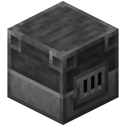
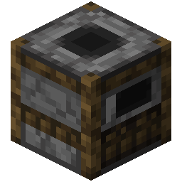
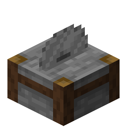

# Crafting Goal

Players have to craft, smelt (or cook) items. More specifically, this goal interacts with the internal 2x2
player crafting, the 3x3 {width=25 height=25} crafting,
the furnace ({width=25 height=25}, {width=25 height=25} and {width=25 height=25})
cooking, {width=25 height=25} (or {width=25 height=25})
cooking, cutting with the {width=25 height=25}
and upgrading with the {width=25 height=25}.

!!!warning Armor trims
Any other action with the {width=25 height=25} (e.g. armor trimming) does not trigger anything. This behaviour is too complex to cover.
!!!

## Configuration

[!badge Individual Dropdown Selection]
:   Select recipes and their necessary amounts individually with the dropdown option.

[!badge All Recipes Once]
:   Every recipe has to be *crafted* once. This includes crafting every item in the {width=25 height=25}.
This also includes smelting every possible item in the ({width=25 height=25} (and {width=25 height=25} and {width=25 height=25}),
cooking every food in the {width=25 height=25} (or {width=25 height=25}),
cutting every possible item into every combination in the {width=25 height=25}
and upgrading all the tools and armor with the {width=25 height=25}.

[!badge All Smelting/Cooking Recipes Once]
:   Every smelting or cooking recipe in the
({width=25 height=25}, {width=25 height=25}, {width=25 height=25} and {width=25 height=25} (or {width=25 height=25}).

[!badge All Netherite Smithing Upgrades Once]
:   Every tool and armor piece has to be upgraded in the {width=25 height=25}.

[!badge Fixed random order]
:   If selected, every recipe has to be crafted/cooked/smelted in a specific order that is determined when the settings file is generated. Otherwise, the recipes can be crafted/cooked/smelted in any order.

## Example Configuration

Below are some examples you can directly copy into your server without using the website.

:::example_configuration
**Example 1**

**Rules:** [NoDeath](../rules/noDeathRule)

**Punishments:** The challenge is over for everyone (EndPunishment)

**Goals:** Craft every item in the crafting table once (Crafting Goal)
:::

[!file Example 1](../static/examples/no_death_end_challenge_crafting_goal_all_crafting_recipes_once.json)

:::example_configuration
**Example 2**

**Rules:** [NoDeath](../rules/noDeathRule)

**Punishments:** The challenge is over for everyone (EndPunishment)

**Goals:** Upgrade all tools and armor to Netherite (Crafting Goal)
:::

[!file Example 2](../static/examples/no_death_end_challenge_crafting_goal_all_crafting_recipes_once.json)

:::example_configuration
**Example 3**

**Rules:** [NoDeath](../rules/noDeathRule)

**Punishments:** The challenge is over for everyone (EndPunishment)

**Goals:** Craft/Smelt/Cook/Upgrade every recipe (Crafting Goal)
:::

[!file Example 3](../static/examples/no_death_end_challenge_crafting_goal_all_recipes_once.json)