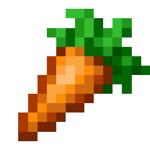
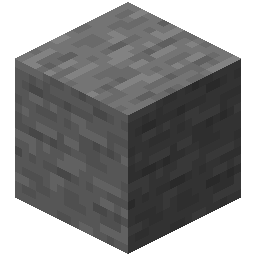

# Item Goal

When Item Goal is selected, a configurable collection of items have to obtained in order to complete the goal. The configuration includes different items as well as amounts. *Obtaining* in this context means being placed in a players inventory in a slot at least once. 

!!!warning Skipping items
Minecraft does not send information about inventory clicks when the player is in creative. If you want to skip an item, perform `/skip` or drop the item from the creative menu and pick it up. **Placing the item from the creative menu in the inventory or using `/give` does not work!**
!!!

!!!info Recipe book
The recipe book is disabled on the server as soon as this goal is selected. This is due to technical implementations.
!!!

## Configuration

[!badge Individual Dropdown Selection]
:   Select items and their necessary amounts individually with the dropdown option.

[!badge Collect everything]
:   Every obtainable item has to be collected once.

[!badge Collect all items]
:   Every *item* that is considered an item but not a block has to be collected (for example: {width=25 height=25}).

[!badge Collect all blocks]
:   Every item that is considered a block (for example: {width=25 height=25}).

[!badge Fixed random order]
:   If selected, every item has to be collected in a specific order that is determined when the settings file is generated. Otherwise the items can be collected in any order.

## Example Configuration

Below are some examples you can directly copy into your server without using the website.

:::example_configuration
**Example 1**

**Rules:** [NoDeath](../rules/noDeath.md)

**Punishments:** The challenge is over for everyone (EndPunishment)

**Goals:** Collect 1 dragon egg (Item Goal)
:::

!!!danger Rename file after download
Rename the file to `data.json` and place it in the `settings` folder! Otherwise the plugin won't recognize the file!
!!!

[!file Example 1](../static/examples/no_death_end_challenge_item_goal_1_dragon_egg.json)

:::example_configuration
**Example 2**

**Rules:** [NoDeath](../rules/noDeath.md)

**Punishments:** The challenge is over for everyone (EndPunishment)

**Goals:** Collect every obtainable item once in a fixed order (Item Goal)
:::

!!!danger Rename file after download
Rename the file to `data.json` and place it in the `settings` folder! Otherwise the plugin won't recognize the file!
!!!

[!file Example 2](../static/examples/no_death_end_challenge_item_goal_every_item_once_fixed_order.json)