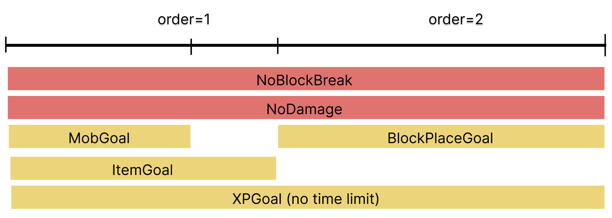

# Timer

Every goal can have a configurable timer. Enabling the timer changes the behaviour of the goal. Now the goal itself can cause the challenge to fail if it is not completed within a time period. 

## Ordering Timers

Timers can also be used to *concat* multiple goals after another. Each timer has a `order` value that determines its ordering compared to other goals. This enforces some implicit assumptions about running goals simultaneously.

Take this challenge setup for example:

Rules are always permanent throughout a challenge. They cannot have timers. Goals can have timers but what happens if goals with the same order number are completed at different times? `BlockPlaceGoal` (the goal with the next order number) will only become active once **all** goals with the current order number are completed. Note that `XPGoal` has to timer and is considered *active* the entire time. This means `XPGoal` can be completed at any time to count towards the challenge completion progress. The other goals will cause the challenge to fail if they are not completed within the set time frame.

!!!info Same goal multiple times in same challenge
While its technically possible to use the same goal in the same challenge multiple times, the builder website arbitrarily constrains that. It just does not make much sense to have the same goal multiple times in the same challenge (even at different times).
!!!

## Time in Timers

Every timer has a minimum and a maximum time. When a goal is started (= the current order number is equal to the order number of the goal), the timer selects a random value between minimum and maximum and uses that as the time limit for this goal. If you don't want a random value, then you can set the minimum and maximum to the same value.

## Configuration

[!badge Order]
:   Set the order of the timer. Timers can have the same order value, meaning they run simultaneously.

[!badge Minimum Time]
:   The lower bound in minutes when determining the time to complete the goal this timer is associated with.

[!badge Maximum Time]
:   The upper bound in minutes when determining the time to complete the goal this timer is associated with.