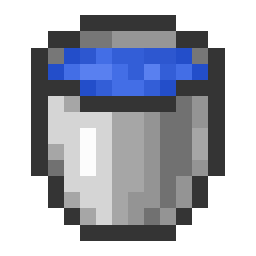
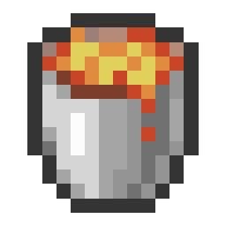

# No Block Place Rule

When No Block Place is selected, then players are not allowed to place blocks.

!!!info Default exemptions
By default, placing a {width=25 height=25} 
or {width=25 height=25} is explicitly allowed. These two are in the exemption list when the rule is enabled.
You can change that by manually removing them from the exemption list.
!!!

## Punishment Trigger

Any player places any block, except for blocks which are in the exemption list.

## Configuration

[!badge Exemptions]
:    Select blocks which are excluded and do not trigger the punishments.

[!badge text="Local Punishments"](../punishments/punishments.md)
:    Select punishments that trigger when this rule is violated.

## Example Configuration

Below are some examples you can directly copy to your server without using the website.

:::example_configuration
**Example 1**

**Rules:** NoBlockPlace

**Punishments:** Every player loses 1 heart (HealthPunishment)

**Goals:** Kill 1 Enderdragon (MobGoal)
:::

[!file Example 1](../static/examples/no_block_place_1_heart_lost_all_mob_goal_1_ender_dragon.json)