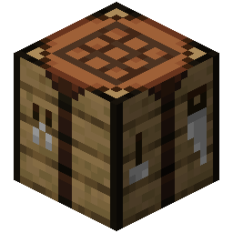
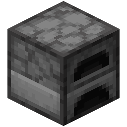
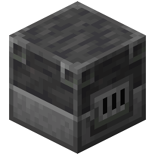
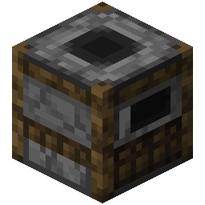
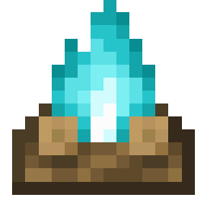
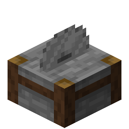
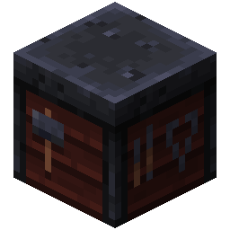

# No Crafting Rule

Players are not allowed to craft, smelt or cook items. More specifically, this rule interacts with the internal 2x2
player crafting, the 3x3 {width=25 height=25} crafting, 
the furnace ({width=25 height=25}, {width=25 height=25} and {width=25 height=25}) 
cooking, {width=25 height=25} (and {width=25 height=25})
cooking, cutting with the {width=25 height=25}
and upgrading with the {width=25 height=25}.

## Punishment Trigger

Recipes in the exemption list take precedence over anything. For example, if crafting is blocked, but the recipe for
crafting sticks is explicitly set in the exemption list, then crafting sticks is allowed.

### Crafting

A player enters the ingredients to craft an item in the {width=25 height=25}
or the 2x2 internal crafting and clicks in the result slot. Just entering the ingredients, so the
to-be-crafted item is shown as the result, does not trigger anything.

### Furnace Smelting

A player cooks/smelts an item in the {width=25 height=25}, {width=25 height=25} or {width=25 height=25}. 
The punishment is triggered when the cooking/smelting
is completed.

### Campfire Cooking
A player cooks an item in the {width=25 height=25} (or {width=25 height=25}). 
The punishment is triggered when the cooking is completed.

### Stonecutting

A player *crafts* an item using the {width=25 height=25}. Just clicking on a recipe, so the to-be-cut item is shown as the result, does not trigger anything.

### Smithing

A player uses the {width=25 height=25} to upgrade their tools/armor to netherite.

!!!warning Armor trims
Any other action with the smithing table (e.g. armor trimming) does not trigger anything. This behaviour is too complex to cover.
!!!

## Configuration

[!badge Exemptions]
:    Select recipes which are excluded and do not trigger the punishments.

[!badge Allow 2x2 crafting]
:    Determines if the player can use their internal 2x2 crafting grid to craft items.

[!badge Allow Crafting Table crafting]
:    Determines if crafting in the 3x3 crafting grid is allowed or not.

[!badge Allow Furnace smelting]
:    Determines if smelting an item in a furnace ({width=25 height=25}, {width=25 height=25} and {width=25 height=25}) is allowed or not.

[!badge Allow Campfire cooking]
:    Determines if cooking an item in a {width=25 height=25} (or {width=25 height=25}) is allowed or not.

[!badge Allow Smithing Table]
:    Determines if using a {width=25 height=25} is allowed or not.
This only affects tools/armor upgrades, not trims. See the note further above.

[!badge Allow Stonecutter]
:    Determines if using a {width=25 height=25} is allowed or not.

[!badge text="Local Punishments"](../punishments/punishments.md)
:    Select punishments that trigger when this rule is violated.

## Example Configuration

Below are some examples you can directly copy into your server without using the website.

:::example_configuration
**Example 1**

**Rules:** No 2x2 and 3x3 crafting (NoCrafting)

**Punishments:** Every player loses 1 heart (HealthPunishment)

**Goals:** Kill 1 Enderdragon (MobGoal)
:::

[!file Example 1](../static/examples/no_crafting_no_crafting_at_all_1_heart_lost_all_mob_goal_1_ender_dragon.json)

:::example_configuration
**Example 2**

**Rules:** No cooking or smelting (NoCrafting)

**Punishments:** Every player loses 1 heart (HealthPunishment)

**Goals:** Kill 1 Enderdragon (MobGoal)
:::

[!file Example 2](../static/examples/no_crafting_no_smelting_cooking_1_heart_lost_all_mob_goal_1_ender_dragon.json)

:::example_configuration
**Example 3**

**Rules:** Nothing is allowed (NoCrafting)

**Punishments:** Every player loses 1 heart (HealthPunishment)

**Goals:** Kill 1 Enderdragon (MobGoal)
:::

[!file Example 3](../static/examples/no_crafting_nothing_1_heart_lost_all_mob_goal_1_ender_dragon.json)